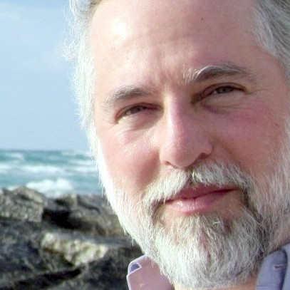

# Speakers

<section class="speaker" id="jeff">
	

		

			

				

					<picture>
						
					</picture>
				

			

			

				

					<h2 class="name">Jeff Jaffe</h2>
					
CEO

					
World Wide Web Consortium (W3C)

				

				

					
Dr. Jaffe holds a BS in Mathematics and an MS in Electrical Engineering and Computer Science in addition to his Doctorate from the Massachusetts Institute of Technology. After receiving a Ph.D. in computer science from MIT in 1979, Jeff joined IBM's Thomas J. Watson Research Center. During his tenure at IBM, he held a wide variety of technical and management positions, including vice president, Systems and Software Research, corporate vice president of technology, and general manager of IBM's SecureWay business unit, where he was responsible for IBM's security, directory, and networking software business. Jeff then served as president of Bell Labs Research and Advanced Technologies, where he established new facilities in Ireland and India, and served as chairman of the board of the New Jersey Nanotechnology Consortium. Most recently, Jeff served as the Executive Vice President and Chief Technology Officer for Novell. He was responsible for Novell's technology direction, as well as leading Novell's product business units. Jeff was appointed by President Bill Clinton to serve on the Advisory Committee for the Presidential Commission for Critical Infrastructure Protection. He has also chaired the Chief Technology Officer group of the Computer Systems Policy Project, and has served on the National Research Council's Computer Science and Telecommunications Board. He is a Fellow of ACM and the IEEE.

				

				

					<h3>Abstract</h3>
					<h4>Innovative Standards for a New Web</h4>
					
Complementing the conference theme of "a new web", this talk focuses on standards opportunities and challenges for the new web.  After all, we certainly need to sustain the principle of interoperability that forms of the foundation of today's web. This talk explores new standards needs for the new web.  Some of these relate to social needs of the web: security, privacy, internationalization, and accessibility.  Others relate to the richness of the web: apps, immersive, highly interactive, data frameworks.  Finally, others relate to e-commerce needs that are driving new requirements on the web.

				

			

		

	

</section>

<section class="speaker" id="sandro">
	

		

			

				

					<picture>
						
					</picture>
				

			

			

				

					<h2 class="name">Sandro Hawke</h2>
					
Fellow

					
World Wide Web Consortium (W3C)

				

				

					
Sandro Hawke is a W3C Fellow at MIT leading the Credible Web (credweb.org) activity to develop consensus data schemas which promote trust on the Web. For many years at W3C he helped develop standard technologies for data sharing and interop, including RDF, OWL, SPARQL, and JSON-LD. He also led MIT's Crosscloud project with Tim Berners-Lee, developing technologies for practical decentralization. He likes coding in modern JavaScript, especially in NodeJS, and still uses emacs.

				

				

					<h3>Abstract</h3>
					<h4>Building a Credible Web — Fighting Misinformation with a Data Ecosystem</h4>
					
In recent years, the global threat of disinformation attacks (eg in elections) and more passive misinformation dangers (eg around vaccines) has become clear. The W3C Credible Web Community Group has been examining what technology can do to help.

					
We frame the problem in the Web context like this: the user, at their browser, needs to decide how much to trust online content. Various systems can help with the frequent mental credibility assessments, including the website being visited, any intermediate sites (news feeds, search engines), and the browser itself. These systems can give the user more information and cross-validate information, as well as analyze it and output the results, or even act on the user’s behalf to block very-low-credibility content.

					
The group’s work is largely in understanding what kind of data might signal high or low credibility and helping that signal data be generated and exchanged in a partially-open data ecosystem.  This talk will describe the group’s results so far and its strategy going forward with an eye toward how people can get involved.

				

			

		

	

</section>

<section class="speaker" id="andrew">
	

		

			

				

					<picture>
						
					</picture>
				

			

			

				

					<h2 class="name">Andrew Shikiar</h2>
					
Chief Marketing Officer

					
FIDO Alliance

				

				

					
Andrew Shikiar is the Chief Marketing Officer at [FIDO Alliance](http://www.fidoalliance.org), a global consortium working to create open standards and an interoperable ecosystem for simpler, stronger user authentication.  He has deep experience in multi-stakeholder organizations, having previously led market development efforts for Tizen Association, LiMo Foundation and Liberty Alliance Project – and also helped structure and launch groups such as the Smart TV Alliance and Open Visual Communications Consortia. 

					
Shikiar additionally has held executive and managerial roles driving a variety of emerging initiatives at leading technology companies. Managerial roles at Sun Microsystems included PR and marketing leadership for the company's Java and identity management initiatives at their inception. Andrew was also a founding executive at Radical Communication, an early entrant in the interactive email & analytics market . Most recently, Andrew served as VP of Marketing & Business Development for machine learning pioneer BigML.

					

						LinkedIn: [https://www.linkedin.com/in/andrewshikiar](https://www.linkedin.com/in/andrewshikiar)
					

					
Twtter: @andrewshikiar
				

				

					<h3>Abstract</h3>
					<h4>FIDO2: A Web Without Passwords</h4>
					
A web without passwords is within reach thanks to a new FIDO2 standards. FIDO2 open standards, developed by the FIDO Alliance in partnership with W3C, allow the consumer electronics industry to build support for easy-to-use, phishing-resistant FIDO authentication directly into their products and platforms. Including the passwordless and second-factor use cases from first generation standards FIDO U2F and FIDO UAF, FIDO2 provides the end-to-end interoperability between devices and online services needed to finally put us past the “shared secret” model of authentication for good.

					
Andrew Shikiar of FIDO Alliance will provide an overview of the FIDO2 vision and where adoption is to date, including the status of three critical pieces needed for adoption at scale: browser and platform support; supporting products and certification programs; and rollout by online services. While passwords will be around for a while, attendees will come away from this session understanding why and how they will begin to disappear.

				

			

		

	

</section>
